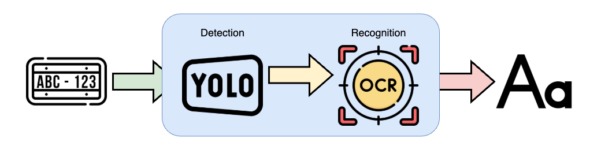

# Taiwan License Plate Recognition

## Introduction

## Environment

- Python 3.12
- optimum[nncf,openvino]
- requests

### Detection (YOLO)

- ultralytics==8.0.238
- roboflow (dataset)

### Recogntion (OCR)

- paddlepaddle
- paddleocr

## Architecture



- First, I use predict API provided by ultralytics and get any supported sources to crop
  license plate images from them.

- Then pass the cropped images to the OCR model to extract license number from the images.

## Usage

- Install dependencies specify in `pyproject.toml`

- Specify environment variables in the `.env`, change any value based on your needs.

  ```
  INFERENCE_DEVICE="cpu"
  NUM_WORKERS=8
  FRAME_SIZE=640
  STREAM_SOURCE={ address to stream source }
  DETECTION_MODEL_PATH={ path to model files }
  API_ENDPOINT={ address of api }
  ```

- execute main.py under `src/`, then it will start the task.

## Implementation

### Detection

- YOLO series models provide high accuracy and fast object detection, so I choose YOLO for detection task.

- To achive fast and lightweight inference on CPU, I choose a bit older and smaller model, YOLOv8n.

  > **Why not choose newer model?**
  >
  > When doing research, I found that there's no significant difference on any aspects between v8 and newer model.
  > For detail can check [ultralytics](https://docs.ultralytics.com/models/yolov8/#supported-tasks-and-modes).

- I train the YOLOv8n on OBB task using dataset from roboflow with some modification.

  > **Why OBB task?**
  >
  > OBB format provide rotation of bounding box as extra information, so I can get more precise result.

#### Training

- I use API provided by ultralytics to do hyperparameter-tuning, traing, evaluation.
  There's not so much technique to do these tasks because ultralytics automatically handles theses for us.
  For detail, just check scripts under `src/yolo/`.

- After training, I can easily use export API to save model as OpenVINO IR format for further use.

- [Result](https://api.wandb.ai/links/hermeschen1116/l16nx6qc)

### Recognition

- First, I try TROCR, a transformer based model for OCR task.
  But it hard to fine tune it on my own dataset.

- So I compare some common OCR methods, EasyOCR, Tesseract, and PaddleOCR.
  And I found PaddleOCR performs the best on my data (a bit obscure).

- And because in Taiwan, we usually can find some stickers and some marks on license plate may contain not related text on them.
  I also implement a `validate_license_number` function to filter out the text in correct format (common 2-4, 4-2, 3-3, and 3-4 format).

#### Training

WIP

## Optimization

- Exporting model to Openvino IR format for fast and efficient inference on CPU so that it can run on weak device.

## Deploy
